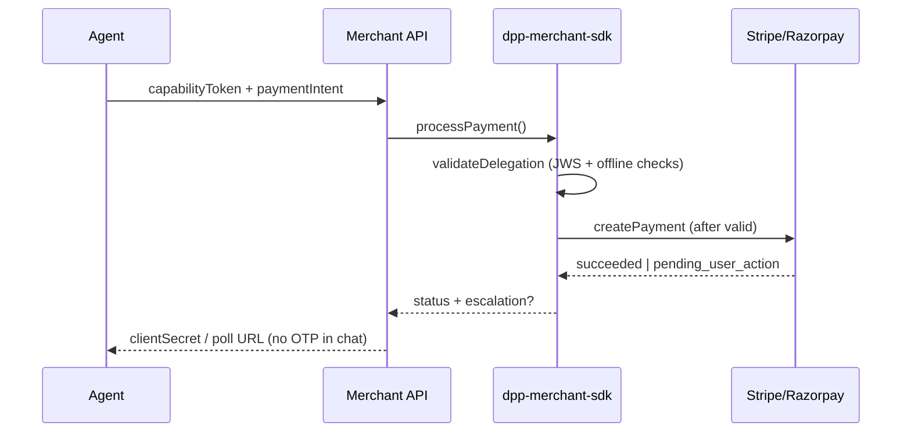

# Merchant SDK Integration Guide (DPP v0.2 alpha)

**Status:** Draft (informative)  
**Last updated:** 2026-05-16  
**Audience:** Merchant backend engineers integrating delegated agent checkout  
**Package:** [`dpp-merchant-sdk`](https://www.npmjs.com/package/dpp-merchant-sdk) ([source](../../sdk/merchant-sdk/))  
**Related:** [verification-flows.md](../protocol/verification-flows.md), [payment-intents.md](../protocol/payment-intents.md), [Express example](../../sdk/examples/express-merchant/)

This guide walks through wiring the **merchant SDK** into your payment server: trust configuration, delegation verification, PSP handoff, escalation handling, and webhooks.

---

## 1. Scope

The merchant SDK helps you:

1. **Verify** wallet-issued capability tokens (JWS) and bind them to a `PaymentIntent`.
2. **Charge** via a PSP adapter (Stripe or Razorpay) only after delegation checks pass.
3. **Surface escalation** when the rail requires OTP, 3DS, or bank approval (`pending_user_action`).
4. **Audit** structured events when `DPP_AUDIT_LOG=1`.

Agents and wallets construct capability tokens and intents; merchants **never** accept raw card data or UPI PINs from agents.

---

## 2. Prerequisites

| Requirement | Notes |
|-------------|-------|
| Node.js 20+ | ESM (`"type": "module"`) |
| Built SDK | `cd sdk/merchant-sdk && npm install && npm run build` |
| Wallet JWKS | HTTPS `jwksUri` or pinned inline `jwks` |
| PSP credentials | Stripe secret key and optional webhook secret, or Razorpay keys |

> **npm:** `npm install dpp-merchant-sdk@alpha`. For monorepo development use `"dpp-merchant-sdk": "file:../../merchant-sdk"` in examples.

---

## 3. Integration sequence



### Step 1 — Configure trust

Pin the wallet issuer and JWKS. Production SHOULD use `jwksUri` over HTTPS plus `issuerAllowlist`:

```typescript
const trust = {
  jwksUri: 'https://wallet.example/.well-known/jwks.json',
  issuerAllowlist: ['https://wallet.example/issuer'],
  audience: ['merchant:your_store_id'], // optional
  clockSkewSeconds: 60,
};
```

Local development MAY use inline `jwks` from your wallet staging environment. The Express example generates ephemeral test keys—**never use that pattern in production**.

### Step 2 — Create the merchant client

```typescript
import { createMerchant } from 'dpp-merchant-sdk';

const dpp = createMerchant({
  psp: 'stripe',
  trust,
  credentials: {
    secretKey: process.env.STRIPE_SECRET_KEY!,
    webhookSecret: process.env.STRIPE_WEBHOOK_SECRET,
  },
});
```

For Razorpay, set `psp: 'razorpay'` and pass `keyId` / `keySecret` per the adapter README.

### Step 3 — Verify before fulfill

On checkout submit, call `processPayment` with the compact JWS string and parsed intent:

```typescript
const result = await dpp.processPayment({
  capabilityToken: req.body.capabilityToken,
  paymentIntent: req.body.paymentIntent,
});

if (result.status === 'pending_user_action') {
  // Return escalation to your frontend — user completes 3DS/OTP on bank surfaces
  return res.status(202).json({
    status: result.status,
    escalation: result.escalation,
    clientSecret: result.psp.clientSecret,
  });
}

if (result.status === 'succeeded') {
  return res.json({ status: 'succeeded', pspPaymentId: result.psp.pspPaymentId });
}
```

Use `dpp.verify()` when you only need delegation validation without creating a PSP charge (e.g. cart preview).

### Step 4 — Webhooks and polling

Register PSP webhooks to your merchant server:

```typescript
app.post('/webhooks/stripe', express.raw({ type: 'application/json' }), async (req, res) => {
  const event = await dpp.handleWebhook(req.body, req.headers['stripe-signature'] as string);
  // Map event.status to order fulfillment — only ship on terminal success
  res.sendStatus(200);
});
```

Poll `dpp.getStatus(pspPaymentId)` when `resumeHint` is `poll_intent`.

---

## 4. Security checklist

- [ ] Reject tokens with forbidden claims (`dpp:otpBypass`, etc.) — enforced by the SDK.
- [ ] Configure `issuerAllowlist` and JWKS pinning; do not skip JWS verification in production.
- [ ] Verify delegation **before** creating PSP charges or marking orders paid.
- [ ] Never log capability JWTs, Stripe secrets, or webhook signing keys.
- [ ] Route OTP/3DS to issuer-controlled UI; agents MUST NOT collect OTP in chat.
- [ ] Enable `DPP_AUDIT_LOG=1` in staging/production log pipelines.

See [verification-flows.md §5–6](../protocol/verification-flows.md) for rail classes and escalation rules.

---

## 5. Error handling

The SDK throws `DPPError` with a stable `code`:

| `code` | Typical cause | HTTP mapping (suggested) |
|--------|---------------|---------------------------|
| `invalid_signature` | Bad JWS or wrong key | 401 |
| `untrusted_issuer` | Issuer not on allowlist | 403 |
| `delegation_invalid` | Amount, merchant, digest, or expiry mismatch | 422 |
| `forbidden_claim` | Token carries bypass claims | 403 |
| `psp_error` | PSP API failure | 502 |
| `psp_not_configured` | Missing peer dependency | 500 |

Offline checks via `verifyDelegation()` return `{ verdict, reasons }` without throwing—use that for diagnostics only after JWS verification.

---

## 6. API reference

### `createMerchant(config, auditLogger?)`

Factory for `DPPMerchant`. Requires `trust.jwksUri` or `trust.jwks`.

**Config (`DPPMerchantConfig`):**

| Field | Type | Description |
|-------|------|-------------|
| `psp` | `'stripe' \| 'razorpay'` | PSP adapter selection |
| `trust` | `JwsTrustConfig` | JWKS + issuer/audience policy |
| `credentials` | `StripeAdapterConfig` \| `RazorpayAdapterConfig` | PSP API keys; Stripe accepts optional injected `stripe` client for tests |

**`JwsTrustConfig`:**

| Field | Type | Description |
|-------|------|-------------|
| `jwksUri` | `string?` | Remote JWKS URL |
| `jwks` | `JSONWebKeySet?` | Inline JWKS (tests / pin) |
| `issuerAllowlist` | `string[]?` | Allowed `iss` claim values |
| `audience` | `string[]?` | Required JWT `aud` intersection |
| `clockSkewSeconds` | `number?` | Default `60` |

### `DPPMerchant`

| Method | Returns | Description |
|--------|---------|-------------|
| `verify(input)` | `ValidateDelegationResult` | JWS + offline delegation checks |
| `processPayment(input)` | `ProcessPaymentResult` | Verify, then PSP `createPayment` |
| `handleWebhook(payload, signature)` | `WebhookEvent` | Verify and parse PSP webhook |
| `getStatus(pspPaymentId)` | `PSPPaymentResult` | Poll PSP payment state |

**`ProcessPaymentInput`:** `{ capabilityToken, paymentIntent, metadata? }`

**`ProcessPaymentResult`:** `{ status, delegation, psp, escalation? }` where `status` follows [verification-flows](../protocol/verification-flows.md) intent states.

### Standalone exports

| Export | Purpose |
|--------|---------|
| `verifyDelegation({ capability, paymentIntent })` | Offline checks on **parsed** payloads (caller must verify JWS first) |
| `validateDelegation({ capabilityToken, paymentIntent, trust })` | JWS verify + offline checks; throws `DPPError` on invalid |
| `verifyCapabilityJws(compactJwt, trust)` | Signature + forbidden-claim gate |
| `StripeAdapter` / `RazorpayAdapter` | Direct PSP use without `DPPMerchant` |
| `transition`, `canTransition`, `isTerminalState` | Escalation state machine helpers |
| `generateTestKeyPair`, `signCapabilityForTest` | **Tests/dev only** — do not ship to production |

### Types (selected)

**`CapabilityTokenPayload`** — wallet-issued claims: `iss`, `sub`, `exp`, `nonce`, `scopes`, `constraints`, optional `intentBind`.

**`PaymentIntentPayload`** — merchant-settled intent: `intentId`, `amount`, `merchantId`, `rail`, `railClass`, `digest`, `idempotencyKey`.

**`EscalationHandle`** — when `status === 'pending_user_action'`: `requiredAction`, `userChannel`, `expiresAt`, `resumeHint`.

Normative schemas: [capability-token.schema.json](../../specs/schemas/capability-token.schema.json), [payment-intent.schema.json](../../specs/schemas/payment-intent.schema.json).

---

## 7. Testing checklist

- [ ] Valid capability + matching digest → `delegation_valid` then PSP create  
- [ ] Expired capability → `delegation_invalid` / `invalid_signature`  
- [ ] Amount above `maxAmount` → rejected before PSP  
- [ ] Stripe `requires_action` → `pending_user_action` with escalation metadata  
- [ ] Webhook signature verification rejects tampered payloads  
- [ ] Forbidden claim in JWT → `forbidden_claim`  

Run the [Express example](../../sdk/examples/express-merchant/) locally for an end-to-end smoke test.

---

## 8. References

- Package README: [sdk/merchant-sdk/README.md](../../sdk/merchant-sdk/README.md)
- OpenAPI sketch: [specs/openapi/merchant-verification.yaml](../../specs/openapi/merchant-verification.yaml)
- Stripe-shaped snippet: [sdk/examples/stripe-delegated-payment/](../../sdk/examples/stripe-delegated-payment/)
