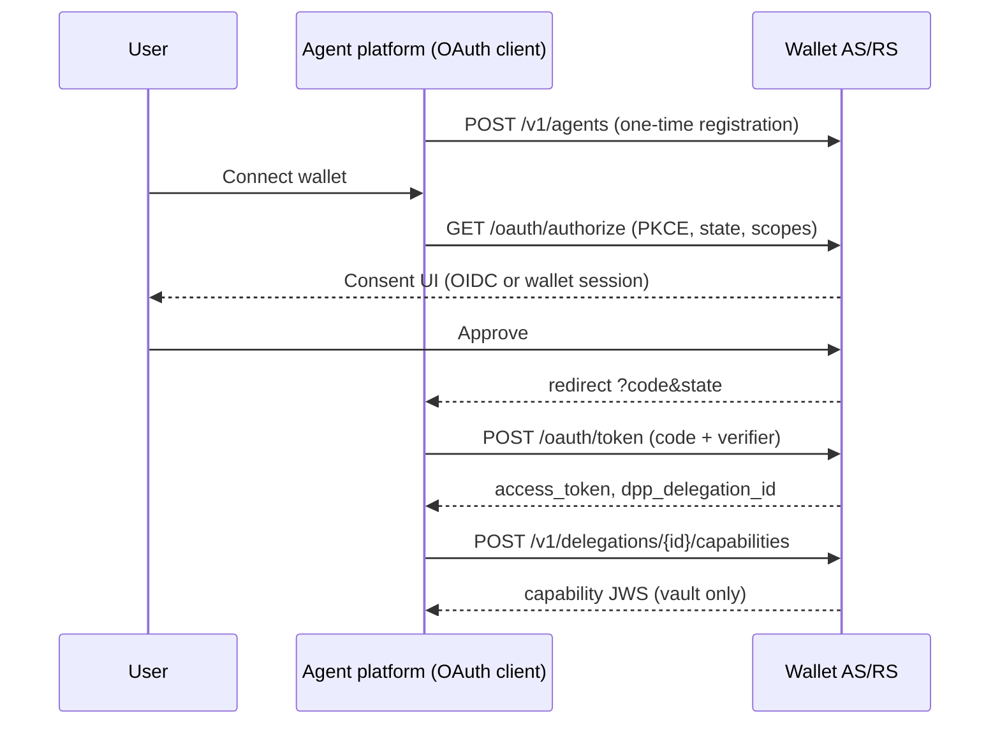

# Wallet OAuth/OIDC Linking Profile (DPP v0.1)

**Status:** Draft specification  
**Last updated:** 2026-05-17  
**Related:** [agent-identity.md](./agent-identity.md), [ADR-001](../architecture/adr-001-capability-token-model.md), [verification-flows.md](./verification-flows.md), [research.md](./research.md), [wallet-oauth OpenAPI](../../specs/openapi/wallet-oauth.yaml), [threat-model v0.1](../threat-model/v0.1.md)

This document defines the **normative OAuth 2.0 / OIDC profile** for linking an **agent platform client** (MCP payment tool, cloud Actions backend) to a **wallet service** on behalf of a user. It covers authorization, token exchange, delegation lifecycle, and revocation.

**Non-goal:** This profile does **not** replace DPP **capability tokens** ([ADR-001](../architecture/adr-001-capability-token-model.md)). OAuth establishes a **wallet API session** for the agent platform; capability JWS tokens authorize **merchant-facing** payment actions.

---

## 1. Scope

| In scope | Out of scope |
|----------|--------------|
| User consent and agent registration before delegation | Merchant PSP charge APIs |
| `authorization_code` + PKCE for public clients | Implicit grant, password grant |
| Access / refresh token issuance and revocation | LLM ↔ wallet direct calls (forbidden — see §2) |
| Binding OAuth tokens to agent `sub` | Raw UPI PIN / card secrets in any token |
| Optional OIDC for user authentication at consent | Full Open Banking ASPSP certification |

Implementers MUST treat this profile as binding for **wallet SDK** (`dpp-wallet-sdk`) OAuth helpers and **wallet HTTP APIs** in [wallet-oauth.yaml](../../specs/openapi/wallet-oauth.yaml).

---

## 2. Architecture boundary (normative)

The LLM **never** calls the wallet. Communication is always:

```
User ↔ LLM host (MCP / Actions) ↔ MCP payment tool (OAuth client) ↔ Wallet HTTPS API
```

| Artifact | Holder | MUST NOT appear in |
|----------|--------|---------------------|
| OAuth `authorization_code` | MCP server (transient) | LLM context, chat logs |
| OAuth access / refresh token | MCP **vault** | LLM context, chat logs |
| Capability JWS | MCP vault | LLM context, chat logs |
| User wallet session cookie | Wallet browser/app only | Agent platform |

Violations are **protocol errors**, not implementation quirks ([threat-model §6.4](../threat-model/v0.1.md)).

---

## 3. Roles and terminology

| Role | OAuth term | DPP mapping |
|------|------------|-------------|
| **User** | Resource owner | Account holder granting delegation |
| **Wallet service** | Authorization server (AS) + resource server (RS) | Issues capabilities, orchestrates rails |
| **Agent platform** | OAuth client | MCP server or cloud Actions backend |
| **Agent** | — | Principal identified by `sub` in capability tokens ([agent-identity](./agent-identity.md)) |

The wallet AS MUST authenticate the **user** during consent (§6). The wallet MUST bind issued tokens to a registered **agent** record (§5).

---

## 4. Discovery (normative)

Wallet services MUST publish OAuth metadata at:

```
GET /.well-known/oauth-authorization-server
```

Response follows [RFC 8414](https://datatracker.ietf.org/doc/html/rfc8414). Required fields for DPP v0.1:

| Field | Requirement |
|-------|-------------|
| `issuer` | HTTPS issuer URL (wallet origin) |
| `authorization_endpoint` | User consent URL |
| `token_endpoint` | Code and refresh exchange |
| `revocation_endpoint` | [RFC 7009](https://datatracker.ietf.org/doc/html/rfc7009) |
| `code_challenge_methods_supported` | MUST include `S256` |
| `grant_types_supported` | MUST include `authorization_code`, `refresh_token` |
| `response_types_supported` | MUST include `code` |
| `scopes_supported` | MUST include DPP scopes in §8 |

Optional OIDC discovery at `/.well-known/openid-configuration` when the wallet uses an external IdP for user login during consent.

---

## 5. Agent registration (normative)

Before the first user link, the agent platform MUST register with the wallet.

### 5.1 Register agent client

`POST /v1/agents` (authenticated — wallet operator or agent platform credentials per deployment policy).

| Field | Type | Requirement |
|-------|------|-------------|
| `clientId` | string | Unique OAuth `client_id` |
| `displayName` | string | Shown on consent screen |
| `redirectUris` | string[] | Exact-match allowlist; HTTPS only in production |
| `agentSub` | string | Stable agent identifier per [agent-identity](./agent-identity.md) §3 |
| `publicKeys` | JWK[] | Optional; used for future request signing |
| `tokenEndpointAuthMethod` | enum | `none` (public + PKCE) or `client_secret_post` (confidential) |

Wallet MUST reject duplicate `clientId` or `agentSub` for active registrations.

### 5.2 Agent lifecycle

| Operation | Endpoint | Effect |
|-----------|----------|--------|
| Rotate keys | `PATCH /v1/agents/{agentId}` | Updates JWKS; does not revoke user links |
| Disable agent | `POST /v1/agents/{agentId}/disable` | Blocks new authorizations; existing tokens MAY be revoked |
| Revoke all user links | `POST /v1/agents/{agentId}/revoke-all` | Revokes all delegations for this agent |

---

## 6. Authorization request (normative)

### 6.1 Grant type

Implementations MUST support **authorization code** with **PKCE** ([RFC 7636](https://datatracker.ietf.org/doc/html/rfc7636)) for clients with `token_endpoint_auth_method: none`.

Confidential clients MAY use PKCE in addition to `client_secret`.

Implementations MUST NOT support implicit grant or resource-owner password credentials for agent linking.

### 6.2 Authorization endpoint

`GET /oauth/authorize`

| Parameter | Required | Description |
|-----------|----------|-------------|
| `response_type` | yes | MUST be `code` |
| `client_id` | yes | Registered agent platform client |
| `redirect_uri` | yes | MUST exactly match one registered URI |
| `scope` | yes | Space-delimited DPP scopes (§8) |
| `state` | yes | CSRF token; client MUST verify on redirect |
| `code_challenge` | yes | PKCE challenge |
| `code_challenge_method` | yes | MUST be `S256` |
| `resource` | recommended | [RFC 8707](https://datatracker.ietf.org/doc/html/rfc8707) resource indicator — wallet API origin |
| `dpp_agent_sub` | recommended | Agent identifier to bind; MUST match registered `agentSub` when present |

### 6.3 User authentication (OIDC)

Wallets MAY authenticate the user via:

1. **Wallet-native session** — user already logged into wallet web/app, or
2. **OIDC federation** — wallet acts as RP to corporate/consumer IdP during consent UI only.

OIDC `id_token` MUST NOT be forwarded to the agent platform. Only wallet-issued OAuth tokens cross the B3 boundary.

### 6.4 Consent screen (normative UX requirements)

The consent UI MUST display:

- Agent `displayName` and `agentSub` (or human-readable alias)
- Requested scopes and **payment constraints** summary (max amount, merchant allowlist if constrained at link time)
- Wallet issuer name and support link

User denial MUST return `error=access_denied` to `redirect_uri` with the same `state`.

### 6.5 Successful redirect

```
{redirect_uri}?code={authorization_code}&state={state}
```

- `code` is single-use, TTL ≤ 10 minutes.
- Codes MUST NOT be returned in URL fragments.

---

## 7. Token endpoint (normative)

`POST /oauth/token`

### 7.1 Authorization code exchange

| Parameter | Required |
|-----------|----------|
| `grant_type` | `authorization_code` |
| `code` | yes |
| `redirect_uri` | yes (must match authorize request) |
| `client_id` | yes |
| `code_verifier` | yes (PKCE) |

**Response (200):**

```json
{
  "access_token": "<opaque-or-jwt>",
  "token_type": "Bearer",
  "expires_in": 3600,
  "refresh_token": "<opaque>",
  "scope": "pay:initiate delegation:read",
  "dpp_delegation_id": "dlg_01H...",
  "dpp_agent_sub": "did:key:z6Mk..."
}
```

| Field | Requirement |
|-------|-------------|
| `access_token` | Authenticates wallet REST APIs (§9) |
| `refresh_token` | Optional; if issued, rotation on use is RECOMMENDED |
| `dpp_delegation_id` | Stable delegation record ID for audit/revocation |
| `dpp_agent_sub` | Agent bound to this delegation; MUST match registration |

Wallet MUST NOT return capability JWS in the token response. Capability issuance is a separate step (§9.3).

### 7.2 Refresh

`grant_type=refresh_token` — wallet MAY rotate refresh token. Scopes MUST NOT expand on refresh.

### 7.3 Errors

Follow [RFC 6749](https://datatracker.ietf.org/doc/html/rfc6749) error codes. DPP extensions:

| `error` | When |
|---------|------|
| `agent_disabled` | Agent registration disabled |
| `delegation_denied` | Policy engine rejected constraints |
| `invalid_agent_sub` | `dpp_agent_sub` mismatch |

---

## 8. Scopes (normative)

Scopes use OAuth syntax; payment semantics are enforced via capability **constraints**, not scope strings alone.

| Scope | Meaning |
|-------|---------|
| `delegation:read` | Read delegation status, rail catalog |
| `delegation:revoke` | Revoke own delegation |
| `pay:initiate` | Create/submit payment intents via wallet API |
| `pay:mandate:read` | Read mandate status |
| `capability:issue` | Request short-lived capability JWS re-issue |

Wallets MAY define deployment-specific scopes prefixed with `pay:merchant:` for allowlist hints. Scopes MUST NOT imply OTP bypass.

Default grant for agent linking: `delegation:read pay:initiate capability:issue`.

---

## 9. Wallet API authentication (normative)

### 9.1 Bearer access token

MCP server calls wallet APIs with:

```
Authorization: Bearer {access_token}
```

Wallet MUST validate:

1. Token signature / introspection
2. Not revoked
3. `dpp_agent_sub` matches the agent for the requested operation
4. Scope includes the operation
5. User delegation still active

### 9.2 Fail closed

On validation failure, wallet MUST return `401` or `403` without partial side effects. Payment intents MUST NOT transition to `succeeded` without valid delegation.

### 9.3 Capability re-issue

`POST /v1/delegations/{delegationId}/capabilities`

Requires `capability:issue` scope. Request body MAY include attenuated constraints (narrow-only per ADR-001). Response returns compact JWS; MCP stores in vault only.

This endpoint bridges OAuth session → merchant verification path.

### 9.4 Delegation revocation

`POST /v1/delegations/revoke`

| Field | Description |
|-------|-------------|
| `delegationId` | Target delegation (or omit when revoking current token's delegation) |

Effects:

1. Invalidate access and refresh tokens for that delegation
2. Reject new capability issuance
3. Reject new payment intents for that agent/user pair
4. In-flight intents follow [verification-flows](./verification-flows.md) terminal rules

Also supported: `POST /oauth/revoke` per RFC 7009 for token-by-token revocation.

---

## 10. Revocation (normative)

### 10.1 Token revocation

`POST /oauth/revoke`

| `token_type_hint` | Token |
|-------------------|-------|
| `access_token` | Access token |
| `refresh_token` | Refresh token |

Wallet MUST cascade: revoking refresh token revokes derived access tokens.

### 10.2 User-initiated unlink

Agent platform `revoke_link` tool → `POST /v1/delegations/revoke` + local vault delete. User MAY also revoke from wallet settings UI (same backend).

### 10.3 Agent-wide revocation

`POST /v1/agents/{agentId}/revoke-all` — operator or security incident response.

---

## 11. Security requirements (normative)

| # | Requirement | Rationale |
|---|-------------|-----------|
| S1 | PKCE S256 mandatory for public clients | Auth code interception |
| S2 | Exact `redirect_uri` match | Open redirect / consent confusion |
| S3 | `state` verified by client | CSRF |
| S4 | No tokens in URL fragments | Leak via Referer/logs |
| S5 | Access token TTL ≤ 1 hour default | Stolen token blast radius |
| S6 | Refresh token rotation recommended | Replay detection |
| S7 | Bind `dpp_agent_sub` at authorize + token | Confused deputy |
| S8 | Rate-limit authorize and token endpoints | Brute force |
| S9 | Audit log: user, agent, scopes, delegationId | Traceability |
| S10 | DPoP ([RFC 9449](https://datatracker.ietf.org/doc/html/rfc9449)) MAY be required v0.2+ | Token sender binding |

*Informative:* FAPI 2.0 patterns (PAR, JARM) are recommended for high-assurance deployments but not mandatory in v0.1.

---

## 12. Linking sequence (informative)



---

## 13. Relationship to capability tokens

| Concern | OAuth access token | Capability JWS |
|---------|-------------------|----------------|
| Purpose | Wallet API session | Merchant delegation proof |
| Lifetime | Short (minutes–hour) | Short (default ≤ 10 min) |
| Audience | Wallet `issuer` | Merchant / rail |
| Payment caveats | Policy at issuance | Embedded in token |
| Carried by | MCP vault | MCP vault → merchant body |

Merchants verify **capability JWS**, not OAuth access tokens ([verification-flows §7](./verification-flows.md)).

---

## 14. Error handling for MCP tools (informative)

| Wallet HTTP | MCP maps to |
|-------------|-------------|
| 401 | `link_expired` — prompt re-link |
| 403 `agent_disabled` | `agent_revoked` |
| 403 `delegation_denied` | `policy_denied` — show constraints |

---

## 15. References

- [RFC 6749 — OAuth 2.0](https://datatracker.ietf.org/doc/html/rfc6749)
- [RFC 7636 — PKCE](https://datatracker.ietf.org/doc/html/rfc7636)
- [RFC 7009 — Token Revocation](https://datatracker.ietf.org/doc/html/rfc7009)
- [RFC 8414 — Authorization Server Metadata](https://datatracker.ietf.org/doc/html/rfc8414)
- [RFC 8707 — Resource Indicators](https://datatracker.ietf.org/doc/html/rfc8707)
- [OpenID Connect Core 1.0](https://openid.net/specs/openid-connect-core-1_0.html) — *informative* for consent-time user auth
- [DPP threat model v0.1](../threat-model/v0.1.md)
- [AGE-33 plan §14](https://github.com/roopamgarg/delegated-payments-protocol) — LLM ↔ wallet communication model
