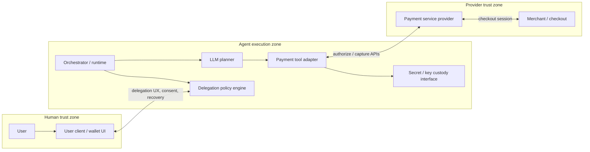
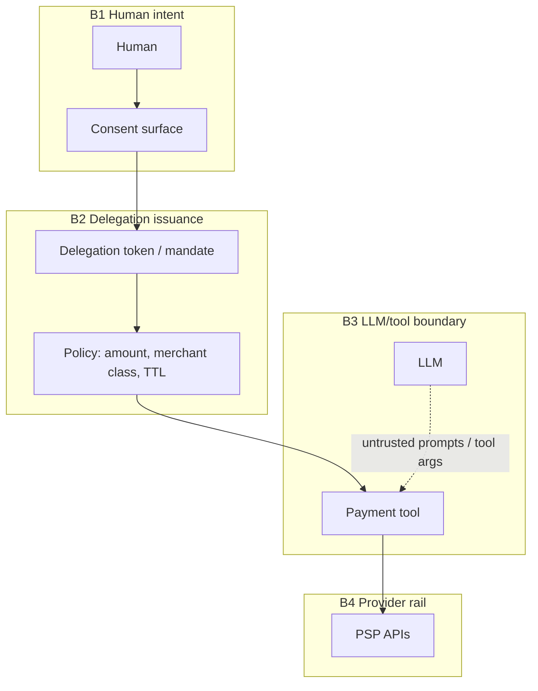

# DPP Threat Model — v0.1

**Protocol:** Delegated Payments Protocol (DPP) v0.1  
**Audience:** Protocol designers, implementation engineers, security review  
**Status:** Draft v0.1 — abstract architecture (pre-concrete API surface)  
**Last updated:** 2026-05-15  

## 1. Scope and assumptions

This document threat-models **DPP v0.1** at the architectural level: an ecosystem where **AI agents initiate or complete online payments on behalf of users** under explicit **delegated authority**.

**In scope**

- Delegation lifecycle (establishment, scope, revocation, expiry).
- Credential and bearer-token handling between user, agent stack, and payment providers.
- Trust boundaries separating **human intent**, **model behavior**, **tool execution**, and **payment rails**.
- Abuse cases driven by **OWASP LLM Top 10** (notably prompt injection, insecure tool/output handling, excessive agency, sensitive information disclosure).

**Out of scope for v0.1**

- Brand-specific PSD2 SCA nuances (treated as requirements on the PSP boundary, not modeled per jurisdiction).
- Formal verification of a specific message-encoding or cryptography suite (referenced only as assurance goals).

**Assumptions**

- Payments ultimately rely on established PSP / card-network / ACH semantics; DPP **does not** replace PSP authentication but constrains **what an agent may request** under delegation.
- The agent stack includes **at least one** LLM or LLM-equivalent planner with **tools** capable of initiating payment actions.

---

## 2. System context



---

## 3. Assets

| Asset | Confidentiality | Integrity | Availability | Notes |
|------|-----------------|-----------|--------------|-------|
| User payment identifiers (PAN tokens, FPAN/DPAN surrogates) | High | High | Med | Prefer network tokens / aliases to raw PAN exposure. |
| PSP access tokens, refresh tokens, API keys | High | High | Med | Bearer secrets; theft enables payment fraud. |
| Delegation grants (scopes, limits, TTL) | Med | Critical | Med | Integrity failure → unauthorized spends. |
| User identity & session bindings | High | Critical | Med | Basis for repudiation and dispute evidence. |
| LLM-visible prompt / conversation state | Var. | Low–Med | Low | Often contains indirect injection channels. |
| Audit / intent evidence (signed approvals, hashes) | Med | Critical | Low | Enables non-repudiation and incident response. |

---

## 4. Trust boundaries (summary)

Boundary crossings must satisfy **complete mediation** (authorize every capability use, every time) and **fail closed** defaults.

| Boundary | Crossers | Representative failures |
|----------|----------|-------------------------|
| **B1 User ↔ Delegation authority** | User client, wallet, recovery flows | Weak consent UX, phishing, MFA bypass assumptions. |
| **B2 User client ↔ Agent runtime** | Structured delegation APIs, deeplinks | Confused deputy / cross-app invocation. |
| **B3 LLM ↔ Tools (capability)** | Tool schemas, adapters | Prompt injection escalating to unauthorized tool calls. |
| **B4 Tool ↔ PSP** | Bearer tokens, mTLS configs | SSRF/OAuth mis-binding, replay, token scope inflation. |
| **B5 Agent platform ↔ Telemetry** | Log pipelines | PII / PAN leakage in prompts and HTTP traces. |

**Diagram (conceptual)**



---

## 5. Threat actors

1. **Remote opportunistic attacker** — phishing, OAuth consent confusion, scraping leaked logs.
2. **Malicious or compromised merchant** — checkout manipulation, amount or payee swaps.
3. **Malicious PSP insider** — high privilege; mitigated mainly by PSP controls + minimal retained data.
4. **Agent platform outsider with network access** — JWT theft, SSRF via misconfigured adapters.
5. **Prompt adversary** (including untrusted third-party tools / content rendered to the LLM) — influences tool selection and arguments **without** traditional OS code execution.

---

## 6. STRIDE by component

Components are logical; implementations may collapse several into one deployment unit. Each cell summarizes **principal** exposures for v0.1.

### 6.1 User client / wallet UI

| STRIDE | Threat | Example | Mitigation themes |
|--------|--------|---------|-------------------|
| S | OAuth / SSO confusion | Evil app reuses delegated redirect | Strict redirect URI pinning, **`state`/`nonce`**, issuer allowlists. |
| T | Trojan UI | Overlay captures PIN | Secure UI layers, binding proofs (device attest where applicable). |
| R | Weak audit of consent | User disputes valid charge | **Signed intent artifact** tying amount, merchant, nonce, TTL. |
| I | Sensitive data screenshots | PAN in clipboard | Minimal display, masking, forbid raw PAN in prompts. |
| D | Spam consent prompts | User fatigue | Rate limits, escalating friction, anomaly detection. |
| E | Jailbreak-assisted bypass | Rooted device hooks | Integrity signals + downgrade to “human-present only.” |

### 6.2 Delegation authority / policy engine

| STRIDE | Threat | Example | Mitigation themes |
|--------|--------|---------|-------------------|
| S | Forged delegation token | Stolen signing key | **Asymmetric signing**, HSM/KMS, key rotation, audience checks. |
| T | Scope inflation | Token edited to `amount:*` | **Canonical encoding**, signed claims, server-side policy merge only. |
| R | No proof of user intent | Disputes | Append-only audit + user acknowledgment signature / WebAuthn where viable. |
| I | Token exfil in logs | Debug prints | Redact structured claims; **no secrets in URLs**. |
| D | Policy evaluation DoS | Nested regex explosion | Timeouts, resource caps, static analysis of policies. |
| E | Break-glass admin path | Operator issues god-token | **Separation of duties**, dual control, short TTL. |

### 6.3 Orchestrator / runtime

| STRIDE | Threat | Example | Mitigation themes |
|--------|--------|---------|-------------------|
| S | Stolen service identity | Compromised workload cred | Workload identity, **least privilege IAM**, short-lived tokens. |
| T | DAG / step tampering | Malicious plugin alters payee | Code signing for plugins, immutable job graphs, policy on graph edits. |
| R | Missing run correlation id | Cannot trace abuse | **Structured security logging** (no PAN), trace ids. |
| I | Central secret sprawl | `.env` in image | **Runtime secret injection**, sealed secrets. |
| D | Fan-out storms | Parallel tool spam | **Budgeting**, concurrency caps, per-user rate limits. |
| E | Privilege retained after delegation ends | Stale session | Session **downgrade** on revocation events. |

### 6.4 LLM planner

| STRIDE | Threat | Example | Mitigation themes |
|--------|--------|---------|-------------------|
| S | N/A (not an identity) | — | Treat LLM output as **untrusted input** to policy. |
| T | Instruction smuggling | Hidden system prompt | Content security boundaries, allowlisted tool docs only. |
| R | Over-reliance on model “safety” | Model refuses but tool still callable | **Server-side pre-auth** independent of model assent. |
| I | Leak of tokens into model context | Tool echo | **Output filtering**, token vault never passed through model. |
| D | Token burn / cost abuse | Infinite planning loops | Hard step limits, cost budgets. |
| E | Indirect prompt injection → pay | Web page text steers tool args | **Human-in-the-loop** for out-of-policy deltas, **argument allowlists**. |

### 6.5 Payment tool adapter

| STRIDE | Threat | Example | Mitigation themes |
|--------|--------|---------|-------------------|
| S | OAuth token presented by wrong actor | SSRF to metadata | **mTLS / DPoP** where supported, strict audience. |
| T | Payee substitution | Merchant id changed in flight | **Dual control**: compare merchant fingerprint with signed user intent. |
| R | Ambiguous idempotency | Double capture | Idempotency keys bound to signed intent hash. |
| I | PAN in error responses logged | Verbose PSP errors | Scrub responses; **allowlist** error mapping. |
| D | Rate-based PSP ban | Agent flood | Exponential backoff, per-tenant quotas. |
| E | Scope creep in refresh | Offline refresh widens scopes | **Refresh token rotation**, scope re-validation. |

### 6.6 Secret / key custody

| STRIDE | Threat | Example | Mitigation themes |
|--------|--------|---------|-------------------|
| S | Stolen cloud KMS role | Lateral movement | Break-glass procedures, **deny-by-default** IAM. |
| T | Malicious secret version | Rollback attack | Immutable versions + integrity monitoring. |
| R | No access audit | Insider abuse | Access logs with actor + justification ticket. |
| I | Backup exposure | World-readable bucket | Encryption at rest, bucket policies, CMK per env. |
| D | Crypto operation throttling missing | AES DoS on HSM | Quotas, caching of derived keys where safe. |
| E | Export of raw keys | `GET /export` debug | **No raw key export** in production paths. |

### 6.7 Payment service provider (PSP) — DPP consumer view

| STRIDE | Threat | Example | Mitigation themes |
|--------|--------|---------|-------------------|
| S | Webhook spoofing | Fake `payment.succeeded` | **HMAC signatures**, timestamp skew checks, replay tables. |
| T | Webhook body tampering | MITM on misconfigured TLS | TLS 1.2+, pinning only if justified, **certificate transparency** monitoring. |
| R | Webhook duplication | Replay | Unique event ids + dedup store. |
| I | Telemetry contains PII | Full PAN in payloads | PSP contract review, **field minimization**. |
| D | API abuse | Credential stuffing against PSP keys | PSP-side + DPP tenant rate limits. |
| E | Merchant impersonation API | PSD2 spoof | Strong merchant onboarding, attestations. |

---

## 7. Attack trees (critical flows)

### 7.1 Delegation establishment

```
Goal: Obtain valid delegation usable for unintended spend
├── Steal OAuth tokens at user device
│   └── Mitigate: short-lived tokens, binding, biometric step-up for high-risk
├── Phish consent on malicious client
│   └── Mitigate: app attestation / known client IDs, phishing-resistant MFA
├── Compromise signing keys for mandates
│   └── Mitigate: HSM, dual control rotation, alerting on anomalous signing
└── Coerce inflated scopes at UX
    └── Mitigate: progressive disclosure, default-deny scopes, conspicuous summary
```

### 7.2 Payment authorization invoked by agent

```
Goal: Move funds to attacker-controlled acquirer
├── Prompt injection alters payee or amount in tool args
│   ├── Mitigate: argument schema validation + cross-check with signed intent
│   └── Mitigate: HITL for deviations from stored mandate
├── Replay captured idempotent authorization
│   └── Mitigate: server-side nonce tied to intent + PSP idempotency keys
├── Race: parallel authorizations exceed cap
│   └── Mitigate: optimistic locking on remaining budget ledger
└── Confused deputy at redirect/OAuth
    └── Mitigate: PKCE (public clients), exact redirect URIs, resource indicators (RFC 8707 pattern)
```

### 7.3 Credential lifecycle

```
Goal: Long-lived bearer access to PSP
├── Exfil refresh token from agent logs
│   └── Mitigate: structured logging bans, vault-only retrieval
├── SSRF via adapter calling metadata URL supplied by model
│   └── Mitigate: SSRF allowlists, no raw URL parameters from LLM without validation
└── Insider snapshot of KMS decrypt paths
    └── Mitigate: ABAC policies, JIT admin, tamper-evident audit
```

*(Trees are intentionally textual for v0.1 portability; graphical variants may be derived.)*

---

## 8. Risk scoring (DREAD)

Scores per dimension **1–10** (higher = worse). **Risk = average**, rounded — used for prioritization, not compliance sign-off.

| Risk ID | Scenario | D | R | E | A | D | Avg | Rationale snapshot |
|---------|----------|---|---|---|---|---|-----|---------------------|
| R1 | Prompt injection crafts unauthorized payment args | 9 | 8 | 8 | 7 | 6 | **7.6** | Core novelty of agent payments; widespread exposure if tools trust LLM strings. |
| R2 | Refresh / API token theft from agent infra | 9 | 8 | 6 | 5 | 5 | **6.6** | Classic high impact; likelihood tied to secret hygiene. |
| R3 | OAuth redirect / consent confusion | 8 | 7 | 7 | 6 | 5 | **6.6** | Proven attack class; amplified if deeplinks carry bearer fragments. |
| R4 | Webhook spoof → wrongful fulfillment state | 7 | 7 | 6 | 7 | 5 | **6.4** | Integrity of payment state drives downstream fulfillment abuse. |
| R5 | IDOR/BOLA on delegation records (future REST) | 8 | 6 | 7 | 7 | 4 | **6.4** | Placeholder for HTTP APIs — **must** be regression-tested early. |
| R6 | Excessive agency — destructive refunds / cancellations | 6 | 6 | 5 | 5 | 5 | **5.4** | Secondary flows often weaker than authorize; scope creep risk. |

---

## 9. Recommended mitigations (cross-cutting)

Aligned to **least privilege**, **defense in depth**, **economy of mechanism**, and **secure defaults**.

1. **Mandate object** — Cryptographically signed structure: user id, max amount (or velocity), merchant allowlist pattern, TTL, nonce, session binding. Every tool call carries a **hash** of the active mandate; policy engine verifies before PSP I/O (**complete mediation**).
2. **LLM/tool isolation** — Model **never** receives long-lived secrets; adapters pull short-lived credentials after server-side authorization.
3. **Argument validation** — JSON schema + semantic checks (merchant id ∈ allowlist, amount ≤ residual budget) independent of LLM (“**insecure output handling**” defense).
4. **Human-in-the-loop** — Configurable thresholds for first-time payees, high amounts, or anomaly scores (**psychological acceptability** vs risk).
5. **Rate & budget controls** — Per user, per agent, per merchant class (**OWASP API4** style abuse).
6. **Telemetry hygiene** — Log security events (authz decisions, mandate use) — **never** log full payment details or bearer tokens (**data protection**).
7. **Supply chain** — Pin dependencies for adapters; CI dependency + container scanning (**Vulnerable Components**).

---

## 10. Residual risks (v0.1)

- **Adaptive prompt injection** remains an arms race; technical controls reduce but do not eliminate creative jailbreak + social engineering combos.
- **PSP heterogeneity** — Some rails lack modern binding primitives (DPoP, sender-constrained tokens); residual fraud shifts to contractual monitoring.
- **Dispute evidence** — Cross-border evidentiary standards may demand stronger non-repudiation than Web signatures alone.

---

## 11. Verification and next steps

| Next action | Owner suggestion |
|-------------|------------------|
| Review and approve v0.1 assumptions + component list | Security / CEO / protocol lead |
| Derive concrete message & crypto profiles from mandates | Protocol engineer |
| Add **regression tests** for authz on any delegation HTTP API (when built) | Engineering |
| Run focused **DAST** on adapter layer once staging exists | QA + Security |
| Track MITRE-style mappings (future) | Security |

---

## 12. References (informative)

- Saltzer & Schroeder — design principles (esp. complete mediation, fail-safe defaults).  
- STRIDE / DREAD — Microsoft SDL–style modeling.  
- OWASP Top 10 (2021) — especially **A01 Broken Access Control**, **A07 Identification and Authentication Failures**, **A10 SSRF**.  
- OWASP API Top 10 (2023) — **API1 BOLA**, **API2 Broken Authentication**, **API4 Unrestricted Resource Consumption**, **API6 Unrestricted Business Flows**.  
- OWASP LLM Top 10 — **LLM01 Prompt Injection**, **LLM02 Insecure Output Handling**, **LLM06 Sensitive Information Disclosure**, **LLM08 Excessive Agency**.  

---

*End of DPP Threat Model v0.1 draft.*

